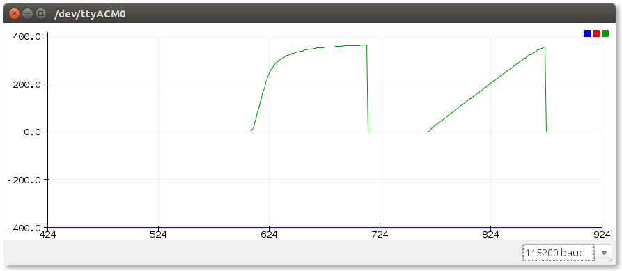

This sample performs a velocity calculation (based off encoder counts per second) while running the motor from zero to full speed using first open, and then closed loop mode. The velocity calulations are be outputted over the serial link and can be viewed using the Arduino IDE's *Serial Plotter* tool.

